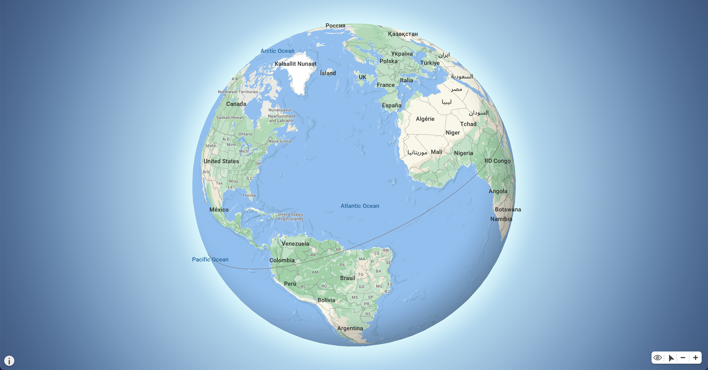

  

<h1 align="center">S2 Maps GPU</h1>

  
  
  
  
  
  

  <a href="https://opens2.com/docs/maps">Documentation</a>
  &nbsp;&nbsp;•&nbsp;&nbsp;
  <a href="https://discord.opens2.com">Discord</a>
  &nbsp;&nbsp;•&nbsp;&nbsp;
  <a href="https://github.com/Open-S2/s2maps-gpu/issues/new">Issues</a>
  &nbsp;&nbsp;•&nbsp;&nbsp;
  <a href="https://github.com/Open-S2/s2maps-gpu/issues/2">Roadmap</a>

 

[S2 Maps GPU](https://opens2.com/s2maps-gpu) is an open source, high-performance, and GPU-accelerated map engine for rendering large-scale, interactive maps. Supports advanced features like `WebGPU`, rendering on a seperate thread using `OffscreenCanvas`, a modern more powerful approach to custom styling of data, rendering complex languages and unicode patterns correctly, and more.

You can learn more about the S2 Map Engine on [our website](https://opens2.com/s2maps-gpu).

## Quick links

- [Documentation](https://opens2.com/docs/maps)
- [API](https://opens2.com/docs/maps/api)
- [Style Specification](https://opens2.com/docs/maps/style-specification)
- [Examples](https://opens2.com/docs/maps/examples)
- [Getting Started](https://opens2.com/docs/maps/getting-started)

## Stability

S2 Maps GPU is currently in **alpha**. We are actively working on it and would love to hear your feedback. We are very close to achieving beta. You can track our progress to beta on [our roadmap](https://github.com/Open-S2/s2maps-gpu/issues/2)

Although it's still a young product, we are using [playwright](https://playwright.dev/) to ensure features that do exist work as intended across all major browsers. Feel free to [open an issue](https://github.com/Open-S2/s2maps-gpu/issues/new) if you find a bug or have a feature request.

---

  

